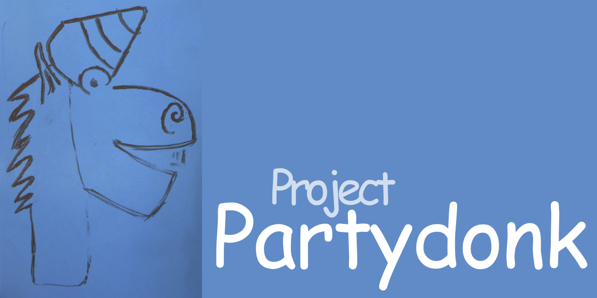

# Partydonk Projects



This project is lays down foundational features and changes that we want to bring to .NET to support both deep learning workloads and scientific workloads that currently make the use of .NET obnoxious in this space.

This draws both from capabilities that have been requested in the past, and both the implementations and designs that have been incorporated into other languages, notably Swift both as part of Google’s efforts with Swift for TensorFlow as well as Apple’s work on Swift Numerics that work in concert.

These are the capabilities that we want to introduce into our runtimes and languages, a more detailed description follows this text.   These capabilities are generally designed to be framework neutral, and could be used with different deep learning and scientific libraries.


- [Generic code over math operations](https://github.com/Partydonk/partydonk/issues/1)
- [Automatic Differentiation](https://github.com/Partydonk/partydonk/issues/2)
- [Python interoperability](https://github.com/Partydonk/partydonk/issues/3)
- [Leveraging MLIR](https://github.com/Partydonk/partydonk/issues/4)
- [Shape Checking](https://github.com/Partydonk/partydonk/issues/5)
- [Automatic Reference Counting Base Type](https://github.com/Partydonk/partydonk/issues/6)

## Abstract Static Interface Members

A prototype for supporting static members as part of an interface's contract,
which is a building block for operator support against generic types that
implement an interface.

Changes are required to both the C# language and .NET runtimes:

* [Roslyn Fork](https://github.com/partydonk/roslyn/tree/dev/abock/asim/asim-playground)
* [.NET Runtime Fork](https://github.com/partydonk/runtime/tree/dev/abock/asim)

### Example

```csharp
interface INumeric<TSelf> where TSelf : INumeric<TSelf>
{
    abstract static TSelf Zero { get; }
    abstract static TSelf operator -(TSelf a);
    abstract static TSelf operator +(TSelf a, TSelf b);
    virtual static TSelf operator -(TSelf a, TSelf b)
        => a + -b;
}

struct PartydonkReal : INumeric<PartydonkReal>
{
    readonly double value;

    public PartydonkReal(double value)
        => this.value = value;

    public static PartydonkReal Zero { get; } = new PartydonkReal(0.0);
    
    public static PartydonkReal operator -(PartydonkReal a)
        => new PartydonkReal(-a.value);

    public static PartydonkReal operator +(PartydonkReal a, PartydonkReal b)
        => new PartydonkReal(a.value + b.value);
}

static TNumeric Sum<TNumeric>(IEnumerable<TNumeric> numbers)
    where TNumeric : INumeric<TNumeric>
{
    var sum = TNumeric.Zero;
    foreach (var number in numbers)
        sum += number;
    return sum;
}

static IEnumerable<TNumeric> Differences<TNumeric>(IEnumerable<TNumeric> numbers)
    where TNumeric : INumeric<TNumeric>
{
    var last = TNumeric.Zero;
    foreach (var number in numbers)
    {
        yield return number - last;
        last = number;
    }
}
```

### Try It Out

_Note: development so far has only happened on macOS. More detailed
instructions are available in the [asim-playground README](https://github.com/partydonk/roslyn/tree/dev/abock/asim/asim-playground/README.md)_.

```bash
$ git clone https://github.com/partydonk/roslyn
$ cd roslyn-asim/asim-playground
$ make runtime
$ make samples
```

# Contributing

This project welcomes contributions and suggestions.  Most contributions require you to agree to a
Contributor License Agreement (CLA) declaring that you have the right to, and actually do, grant us
the rights to use your contribution. For details, visit https://cla.opensource.microsoft.com.

When you submit a pull request, a CLA bot will automatically determine whether you need to provide
a CLA and decorate the PR appropriately (e.g., status check, comment). Simply follow the instructions
provided by the bot. You will only need to do this once across all repos using our CLA.

This project has adopted the [Microsoft Open Source Code of Conduct](https://opensource.microsoft.com/codeofconduct/).
For more information see the [Code of Conduct FAQ](https://opensource.microsoft.com/codeofconduct/faq/) or
contact [opencode@microsoft.com](mailto:opencode@microsoft.com) with any additional questions or comments.
